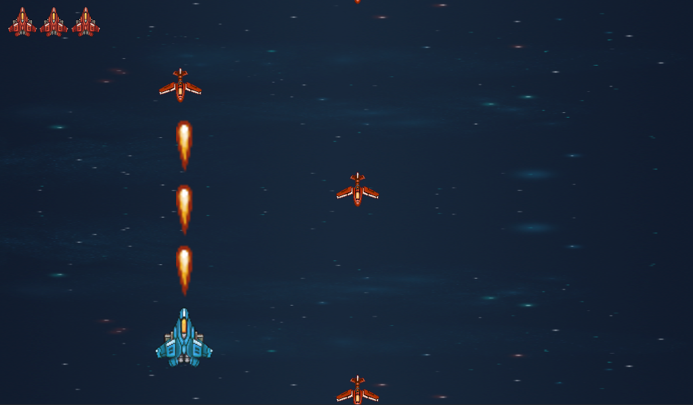

# jogo de nave Godot Engine
 

 

* As três naves no canto superior esquerdo indicam a quantidade de vida;
* Você só irá perder suas vidas se a sua nave (*nave azul*) se chocar com as adversárias (*naves vermelhas*);
* Após perder as três, jogo finaliza com uma mensagem de *game over*;

# Getting Started

* Executável do jogo -> [CLIQUE AQUI](https://github.com/Yurih1/jogo-nave-godot/blob/master/jogo-nave-godot/jogo.exe/)  
**ATENÇÃO: *Para o jogo.exe rodar você tera que clonar todo repositório para sua maquina local.***

* O .exe é exclusivo para usuários windows desktop;
* Para ver como exportar o executável de outras versões de SO -> [CLIQUE AQUI](https://docs.godotengine.org/pt_BR/latest/getting_started/step_by_step/exporting.html) para ter acesso a documenteção oficlal do godot Engine;
* Para baixar o Godot Engine -> [CLIQUE AQUI](https://godotengine.org/download/) Escolha o seu sistema operacional e a versão **Mono version (C# support).**

# License
* Sinta-se livre para utilizar da maneira que achar melhor :wink:
